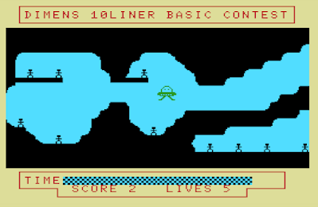
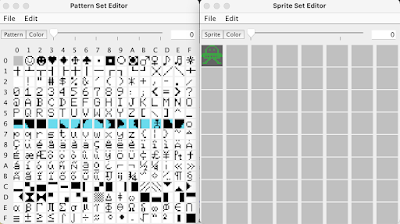
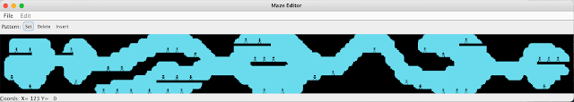
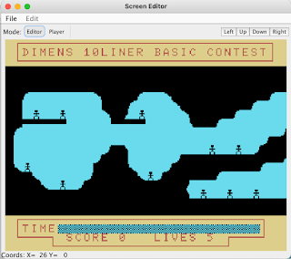
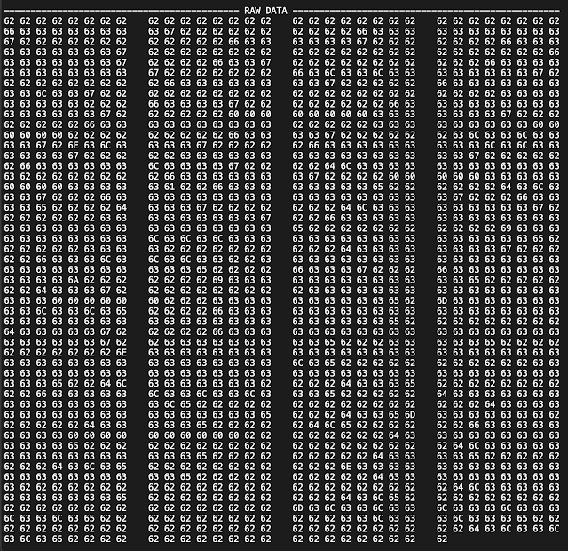
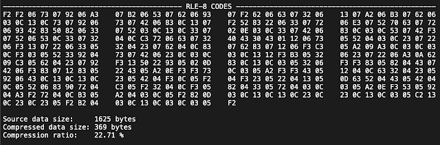
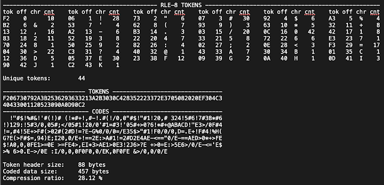
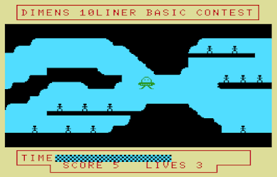

<b>DIMENS 10</b>

Last year I presented a program to the 10th Edition of BASIC 10 Liner Contest, and the experience was very interesting and encouraging. The main idea is that you develop a game in BASIC with no more than 10 lines of code for 8 bit legacy computers. There are different categories depending on the maximum number of characters per line allowed. After I got notice of the announcement of the 11th Edition of BASIC 10 Liner Contest, I decided to participate, this time with a challenging and technically difficult game (at least for me :-). In this post I will describe my submission to the EXTREME-256 category for this year edition (2022), which I have named Dimens10.



<b>The idea</b>

Some time ago I found part of the code of a fast scrolling game I wrote ins the 80's. It was very simple and used some machine code for the scrolling part, which unfortunately I did not found. It was named Cuarta Dimensión (4th Dimension). Not so long ago I started writing a program to automatically generate BASIC code for maze-scrolling programs, which I call aMazeing. With this editor I coded a simple mockup re-incarnation of the game.

For this submission I wanted to make something similar, which is a challenge because the maze is rather large and needs a lot of code to program it. The base game consisted in roughly 100 lines of code and occupied 14 kB. I only needed to reduce it to 10 lines of code which must not exceed 2.56 kB (that is 256 bytes per line of code, including line numbers). Not so simple.

In a game you typically start with an idea, gameplay, some graphics and then start coding. In this case I started coding the technical parts, then creating a gameplay which could fit the available space. Just the opposite, although I believe that is not that uncommon.

I have implemented the game for a MSX-1 machine in SCREEN 1 mode, that is, a semi-graphics mode: you can combine text and sprites, with several coloring constraints. The characters table can be modified so that standard ASCII chars have a different look. The graphics are created by modifying the characters table and locating then was desired on the screen. The only thing that prevents this program to be a pure MSX-1 is the extra VRAM memory needed (more than the basic 16 kB of MSX-1).

Because moving the characters on screen for scrolling in BASIC is quite slow, I decided to give MSX BASIC Kun a try. BASIC Kun (a.k.a X-BASIC) is a BASIC compiler which is almost a de facto standard. The rules of the contest allow using compiled code. Although it is not strictly necessary (the developed game runs fine without the compiler), the non-compiled experience is quite bad.

<b>The methodology</b>

I use aMazeing both for defining the graphics and for generating the code. aMazeing is a program developed in Java which allows the automatic generation of BASIC code (currently only MSX SCREEN 1) for vertical and horizontal scrolling games. The process is as follows (well, actually it is not, it is in fact an iterative process, you know, but you get the idea).

You start modifying the characters table creating patterns that will make part of the graphics of the game, and the sprites table, both their pixmaps and their colors. I have modified 15 8x8 characters and created a single16x16 sprite.



The next step is the creation of the maze, which is coded as a bidimensional array of characters/patterns. I have created a 125x13 array and filled it with the modified characters from the characters table.



The last step is filling the screen with characters, those which will not scroll (the base screen).



Now here it comes the funny part: coding. I have implemented a specific module for generating BASIC code for the 10-liner contest, in addition to the standard BASIC coding. Because coding a 10-liner is a highly iterative process in which you move pieces of code so that they fit the number of lines (10) and the maximum characters per line (256), this module includes a line counter and a character counter. This is very handy in order to know how much space is available per line. Below appears the count for Dimens10.

```
	0 chars=255
	1 chars=255
	2 chars=224
	3 chars=247
	4 chars=247
	5 chars=253
	6 chars=245
	7 chars=212
	8 chars=240
	9 chars=221
-------------------
Total lines=10     
Total chars=2399   
```

Last, but not least, code generation is quite tricky. For standard BASIC, it is straightforward: you generate DATA lines with all the definitions (patterns, sprites, maze, screen, etc) and then code to read all of them and modifying the corresponding graphical memory (VRAM in MSX parlance). For the 10-liner we need exactly the same, but everything squeezed in ten lines of code. Which is not straightforward at all. In this case, instead of generating a template of BASIC code and then manually coding the game logic, I in-lined the code for the logic with the code for generating the 10-liner. What makes the "wow" is that the BASIC code is parametrised with Java code, as in:

```
encodeLine (writer, "W!=W!-4*(S=4ORS=6)-0.75*(S=5)+4*(S=2ORS=8)+0.75*(S=1):K="+confd.VDP_FREEMEM+"+X+INT(U!/8+1)+(INT(W!/8+1)+"+MAZEOFF+")*"+mazed.mazex+":IFVPEEK(K)="+CHRTRG+"THEND=D+1:F=1:BEEP:LOCATE10,22:PRINTD:VPOKEK,"+CHRSKY+ "ELSEIFVPEEK(K)<>"+CHRSKY+"THENVPOKEK,"+CHRSKY+":V=V1:F=1:LOCATE20,22:PRINTV:BEEP:IFV=0THENT#=4.8");
```

<b>The programming</b>

If you do the basic maths, I need to code the following:
* maze. 125x13 cells. Total 1625 bytes
* patterns. 15 characters (8x8 bits). Total 120 bytes
* sprites. 1 sprite (16x16 bits). Total 32 bytes
* screen. 32x24 characters. Total 768 bytes

If we add it all, we get a total of 2545 bytes, For a total of 2560 bytes available (10 lines x 256 bytes/line). NO WAY !!!!!. And this is only for the data part. To make it harder, the BASIC code can not contain some of the available charts, like the null (0) or delete (127) characters. To make it even harder, I develop in OS X, which produces a different coding for the non-standard ASCII chars. All of this implies: we need to compress the data in order to reduce the footprint in the BASIC code, and we need to code it using standard printable ASCII characters. Major actions required.

Patterns and sprites require little information. Because of this, it is not work making any compression. I have encoded this part in hexadecimal, which means that for every byte I need to write two bytes in BASIC. Total 304 bytes, an encoding ratio of 200%. A little bit over 1 line of BASIC code. Not that much. Uncoding is very easy and compact, as shown below. The overhead of data encoding is compensated with the compact reading code.

```
10 READ H$:FOR I=0 TO 119:VPOKE 768+I, VAL("&H"+MID$(H$,I*2+1, 2)):NEXT I                
20 DATA FFFFFFFFFF000000FFFFFFFF7F3F3F1FFFFFFFFFFFFFFFFF000000000000000000808080E0F0F8FE000101010303071FF8E0C0C0808080007F1F0F07010101007F3F1F3F0F0F1F3FE0F0F8FCFCF8C080070F0F070F0F030180808080808080801C1C083E081C2222F8FCFCFEFFFFFFFFFFFFFFFFFEFCFCF8            
```

The screen is a little more challenging, because it is rather large. In this case it is compressed and then encoded. One of the simplest compression schemas is RLE-16 (run length encoding), which works pretty well when there is a large number of repeated bytes, as it occurs in the screen: there are large areas with the same character. Each 16-bit RLE entry consists on two parts: a counter (1 byte) and a value (1 byte). Basically you code the number of times a given value is repeated in contiguous positions. The actual coding of the screen is shown below.


As you may notice, there are large areas in the raw data (screen) with equal values. The coding is very compact, with a compression ratio around 22%. Encoding is make in hexadecimal, as in the patterns and sprites case above, which doubles the size for a real compression+encoding ratio of 45%. The reading code is more complex and larger than before, as shown below.

```
10 P=6144:FOR T=1 TO 2:READ H$:FOR I=1 TO LEN(H$) STEP 4:R=VAL("&H"+MID$(H$,I,2))        
20 O=VAL("&H"+MID$(H$,I+2,2)):FOR J=0 TO R:VPOKE P,O:P=P+1:NEXT J,I,T                    
30 DATA 002000181B1700190120001600440049004D0045004E0053002000310030004C0049004E00450 ...
```

Finally, we get to the maze, which is even more challenging because of its size. In this case the maze is compressed and then encoded. But instead using RLE-16 I have used RLE-8, in which a RLE entry is 8 bits: 4 bits for the counter and 4 bits for the value. With this schema we can encode up to 16 different values. This is the main reason we have only modified 15 entries of the characters table. The actual coding of the maze is shown below.




The coding is very compact, with a compression ratio around 23%. The problem in this case is that if we encode the compressed data in hexadecimal we get 738 chars which is way too large. The trick now is to use a lookup table. We find the different RLE-8 codes, and put then in a linear array. We encode each RLE-8 adding the position in the array to the ASCII value 32. This produces ASCII printable characters. If the number of RLE-8 codes is reduced, the size of the lookup table is small, and so is the overhead of the encoding. The actual encoding of the maze is shown below. The tokens table shows the RLE-8 code (tok), the offset in the lookup table (off), the encoded character (chr), and the number of times the RLE-8 is used (cnt).



The coding is compact, with a compression ratio around 28%. Although all these characters are printable, not all of them can be placed in a DATA statement, for instance the quotation mark character ("). Of course the encoding scheme can be modified to avoid using some of the characters, but this implies having a larger and more complex code. There is an alternative which is coding all the data in a REM statement, in which you can put any writable character. The reading code simply has to run through the memory space where the BASIC program is stored and read characters following the REM statement (in MSX-BASIC the REM statement can be written also with the apostrophe character ('). In this case the comments are placed along two different lines of code. The content of the first BASIC line starts at address 0x8008. The reading code is much more complex than before, as shown below.

```
0 'F206730792A3B2536293633213A2B3030C428352223372E3705082020EF304C340433001120523090  
A0D90C2  !"#$!%#&!'#(!)# (!*#+!,#-!.#(!/0,0"#$!"#1!20,# 324!5#6!7#38*#6!)129:!5#3/0,  
05#;</05#1!20/0'#1=#3!'05#+>0?6!*#+@ABACD!"E3>/0F#4!=,#4!5E+>F#(>02#(2#D!=?E-G%0/0/0=/E                                                                                   
1 KEYOFF:DEFINTA-Z:SCREEN1,2:BLOAD"XBASIC.BIN",R:'35$>"#1!F0/0/0,D=.E+!F#4!%H(G?E(>   
F#$=,94)E;I20,0/E+!==2E:>A#1!=2#D2E4AE-<=="0/E-==AED>0*+>FE$!A0,0,0FE1>=0E >=FE4>,    
EI*3>AE1>0E3!2J6>?E +>0=E:>5E6>/0/E-<='E$>% 6>0.E->/0E :I/0,0,0F0F0,0/EK,0F0FE &>/0,0/0/E                                                                                 
2 P=16384:Q=&H8009+88:FORI=0TO368:G=PEEK(Q+I-37*(I>=164)):K=&H8009+(G-32)*2:          
K=VAL("&H"+CHR$(PEEK(K))+CHR$(PEEK(K+1))):R=K\16:O=(KMOD16)+96:FORJ=0TOR:             
VPOKEP,O:P=P+1:NEXTJ,I:P=6144:FORT=1TO2:READH$:FORI=1TOLEN(H$)STEP4:                  
R=VAL("&H"+MID$(H$,I,2)):O=VAL("&H"+MID$(H$,I+2,2)):FORJ=0TOR:VPOKEP,O:P=P+1:NEXTJ,I,T
```

This piece of code might need a deeper explanation. In line 0, the first par of the REM statement is the coding of the lookup table, that contains 88 characters (encoding of 44 hexadecimal values). Then the rest of the line plus the REM statement of the next line (line 1) contains the printable ASCII coded offsets of the lookup table. Line 2 contains the code for reading the maze, which is stored in a zone of the VRAM that is not used in SCREEN 1 mode. The variable P is the pointer to the VRAM area, and it is incremented by one at each decode maze cell. The variable Q is the pointer to the RAM area that stores the offsets of the lookup table, and it is incremented any one for each character in the remaining of the REM statement in line 0, with a jump (37 characters) needed to continue with the REM statement in line 1. When a character is read from the REM statement, it is stored in the variable G. The variable K is then calculated as a pointer to the corresponding position of the lookup table, derived from G minus the ASCII value 32. Then, from the calculated lookup table position we read the first nibble as R (which encodes the counter) and the last nibble as O (which encodes the value). Now it is just a matter of writing R-times the O value in the VRAM memory. I know it is a little messy, but fitting a maze of 1625 bytes in some 650 characters is worth the effort !!!!!

The state of the game is coded using the following variables:
* X (Integer): horizontal offset of the maze, used for implementing the scroll. Varies in the 1 .. 93 range
* F (Integer): zero by default. It takes the value of 1 when the maze has to be redrawn (typically when a scroll is needed, that is, when X has changed value)
* U! (Float): horizontal position of the sprite in pixels. It starts in the middle of the screen. When the maze is in the initial position (X=1) its value can be in the range 1 .. 128. When the maze is in the final position (X=93) its value can be in the range 128 .. 220.
* W! (Float): vertical position of the sprite in pixels. Its value is only constrained by the shape of the maze.
* T# (Double): time left. It encodes also the horizontal position of the end of the time bar, and varies in the range 27 .. 5. As the time decreases the time var is overwritten with the space character.
* D (Integer): current score of the game. Each time the sprite collides with a person character the value increases
* V (Integer): number of lives left. It is decreased after each collision

Most of the logic of the game is pretty straightforward. They only tricky part is the movement of the sprite. Because the scroll takes some time, the amount added or subtracted to U! and W! must take into account if the maze is scrolling. If the cursor keys are just up or down (S=1 or S=5) there is only vertical movement and W! is increased or decreased by 0.75 pixels. In other case W! is increased or decreased by 4 pixels. If the horizontal cursor keys are pressed (alone or in combination with the vertical ones) U! is increased or decreased by 1 pixel only if the maze is at the beginning (X=1) or the end (X=93). This code is shown below.

```
10 S=STICK(0):IFS>1ANDS<5ANDX<93ANDU!>120THENX=X+1:F=1ELSEIFS<9ANDS>5ANDX>1ANDU!<132THENX=X-1:F=1                
20 U!=U!-1*(S>1ANDS<5AND((U!<128ANDX=1)OR(U!<220ANDX=93)))+1*(S<9ANDS>5AND((U!>3ANDX=1)OR(U!>128ANDX=93)))           
30 W!=W!-4*(S=4ORS=6)-0.75*(S=5)+4*(S=2ORS=8)+0.75*(S=1).  
40 PUT SPRITE 0, (U!,W!), 12                               
```

I finally had a code of 2.4 kB, in 10 lines of BASIC, with standard ASCII character coding. Nice. Goal achieved. Because I have some free space to spare, I left an Easter egg in the code. Can you find it? (come on, it is not that difficult, find it!!!). You can find the code, a simulator disk file (DSK) and some multimedia materials here:

GitHub: https://github.com/humbertomb/mymsx/tree/master/dimens10

<b>Instructions</b>

Loosely based on "The Three-Body Problem" trilogy by Liu Cixin. If you have not, READ IT.

The humanity is at the edge of extinction. The Trisolarans, from the Alpha Centauri system, are putting pressure after the massive extinction of the galactic fleet. Those remaining alive stay hidden in an underground cave, free of the influence of the Shopons. A Trisolaran launched fotoid is expected to impact the Sun in 22 time units. After that, the Solar system will be a huge fireball, with no hope for any kind of life.

You are the mighty pilot (yes, like the mighty ducks, well, sort of) of a flying saucer. Your mission is to recover as many humans as possible from the cave before the fotoid reaches the Sun. Use the arrow keys to move the flying saucer around the cave, picking up as many humans as you can, and avoiding contact with the walls of the cave. The flying saucer is designed with five protective barriers. The barriers are lost with each collision. If the time decreases to zero or you collide more than five times ... the game is over.



Are you ready? Can you save humankind? Let's try it.

Download the file dimens10.dsk from GitHub and drag&drop it on the blue console of WebMSX (a nice application by Paulo Augusto Peccin). A pop up window appears and select Drive A. Then the simulator loads the disk and automatically executes the program.

Too complex? 

I have prepared a web page which automatically loads and executes the program in WebMSX. [Follow this link to play online](https://giia.inf.um.es/storage/archer10.html)

Enjoy playing!!


